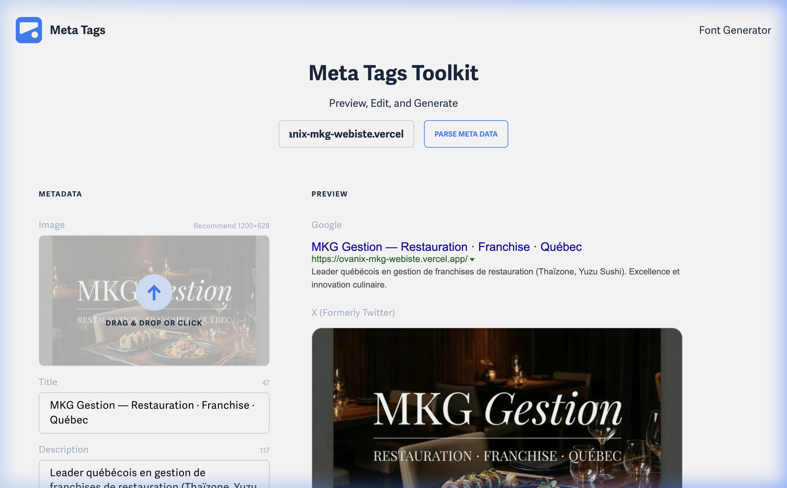

# Walkthrough - Website Metadata Optimization

I have implemented a comprehensive metadata and social media optimization strategy for the MKG Gestion website. This ensures that the site looks professional and branded when shared on platforms like Facebook, LinkedIn, and Twitter, while also improving its search engine visibility.

## Changes Made

### 1. Robust Metadata Implementation
- **SEO Optimization**: Added `description`, `keywords`, `author`, and `theme-color` tags to all internal pages.
- **Social Media Previews**:
    - **Open Graph (OG)**: Implemented `og:title`, `og:description`, `og:image`, `og:type`, and `og:url` for all pages.
    - **Twitter Cards**: Added `twitter:card` (summary_large_image), `twitter:title`, `twitter:description`, and `twitter:image`.
- **Customization**: Each subpage (Careers, Franchises, Team, Promotions, Achievements) has its own uniquely tailored title and description to improve click-through rates.

### 2. High-End Asset Generation
- **Open Graph Image**: Generated a unique, high-quality image (`og-image.png`) that follows the "Luxury Editorial Minimalism" aesthetic.
- **Favicons & Touch Icons**: 
    - Created a standard `favicon.ico` for legacy support.
    - Generated a high-resolution `favicon.png` (32x32).
    - Produced a professional `apple-touch-icon.png` (180x180) for a premium experience on mobile devices.
- **Asset Management**: All new assets are organized in the `brand_assets/` directory.

### Open Graph Image

### Live Verification Proof

### Favicons
The new favicons are located in [brand_assets/favicons/](../../brand_assets/favicons/).

## How to Verify
Once the website is deployed, I recommend using the following tools to preview the metadata:
- [Facebook Sharing Debugger](https://developers.facebook.com/tools/debug/)
- [LinkedIn Post Inspector](https://www.linkedin.com/post-inspector/)
- [Twitter Card Validator](https://cards-dev.twitter.com/validator) (for internal verification)

### Technical Summary
- **Files Modified**: 
    - `index.html`
    - `carrieres/index.html`
    - `nos-franchises/thaizone/index.html`
    - `nos-franchises/yuzu-sushi/index.html`
    - `notre-equipe/index.html`
    - `promotions/index.html`
    - `realisations/index.html`
- **Domain Fix**: All internal links for Open Graph and Twitter Cards have been updated from `mkg-gestion.com` to `ovanix-mkg-webiste.vercel.app` to ensure live previews work while the custom domain is being configured.

> [!TIP]
> **Future Domain Update**: If you decide to switch to a different final domain (e.g., `mkg-gestion.ca`), you can perform a global search and replace for `https://ovanix-mkg-webiste.vercel.app/` in the codebase to update all metadata at once.

